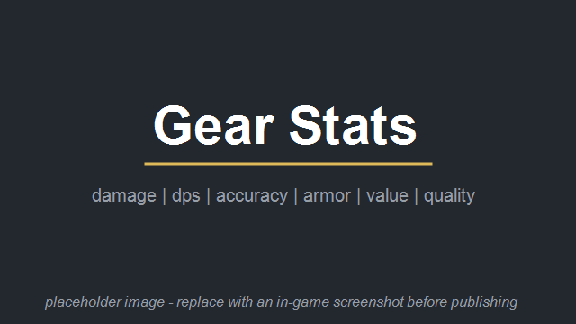

# Gear Stats


View sortable stats of every weapon, piece of apparel and turret on the current map
in one table - damage, DPS, accuracy, range, armor, insulation, market value and
quality. Filter what is shown and sort by any column.

Fork of "Weapons Tab" by bodlosh, restructured and updated.

## How it works

A "gear" button appears in the bottom main tab bar. It opens a table of everything
relevant on the current map, split into tabs: ranged weapons, melee weapons,
grenades, apparel and turrets.

- Click any column header to sort by that column, click again to flip the order.
- Checkboxes filter what is listed: items on the ground, items equipped by
  colonists, friendlies, hostiles or prisoners, items on corpses, craftable
  items and items in storage.
- Click the pawn button to apply a pawn's stats - shooting skill, genes, traits,
  age - to all weapon rows: aiming time, cooldown, melee damage and armor
  penetration and effective range recompute exactly as the game does when that
  pawn fires the weapon. "Pawn: none" returns the raw stats. Hover the pawn
  button to see which of the pawn's traits, genes and hediffs shift aiming time,
  cooldown or melee damage, with the game's own value breakdown per stat.
- Ranged weapons can switch the accuracy column between all/average and a single
  range bracket, labeled with its actual distances, e.g. "Short (3-12)". The
  sorted column survives bracket switches.
- Odyssey unique-weapon traits factor into the stats like they do in game (burst
  count and speed for DPS) and are listed on the weapon's name tooltip.
- Click a row to jump to the item, and use the debug window (dev mode) to inspect
  the raw stats of a thing.

## Compatibility

- No hardcoded defs: modded weapons and apparel are picked up from their stats
  like vanilla gear.
- Combat Extended: extra columns (sway, spread, sights, magazine capacity,
  counter-parry, AP) appear automatically when CE is active.
- Weapon Storage and Change Dresser: items stored in their containers are
  included when those mods are loaded.
- No Harmony patches and no def changes, safe to add and remove at any time.

## Technical notes

- Requires RimWorld 1.6. No other dependencies.
- Pure UI mod: it only reads existing things on the map, nothing is saved to the
  game state. The list refreshes on a short interval while the tab is open, not
  every frame.
- The main tab is registered as a `MainButtonDef`, so other mods can reorder or
  remove it through normal def XML.
- Shooter-adjusted numbers mirror the vanilla formulas (`VerbProperties.AdjustedCooldown`,
  `AdjustedMeleeDamageAmount`, `GetDamageFactorFor`) instead of approximating
  them, so the table always agrees with what the pawn would actually dish out.
- Melee: damage and cooldown show the weapon's strongest attack with quality and
  material multipliers; DPS is the vanilla selection-weighted average across all
  its tools. With a pawn selected both are computed exactly like
  `StatWorker_MeleeAverageDPS` computes them for the wielding pawn.

## Build from source

Requires the .NET SDK. Build the Release configuration for the dll you ship - a plain
`dotnet build` defaults to Debug:

```
cd Source/GearStats
dotnet build -c Release -p:RimWorldDir="C:\Path\To\RimWorld"
```

The output lands in `Assemblies/GearStats.dll`; the whole mod folder can be
copied or symlinked into the game's `Mods` directory.

## Credits

- Original "Weapons Tab" mod: bodlosh.
